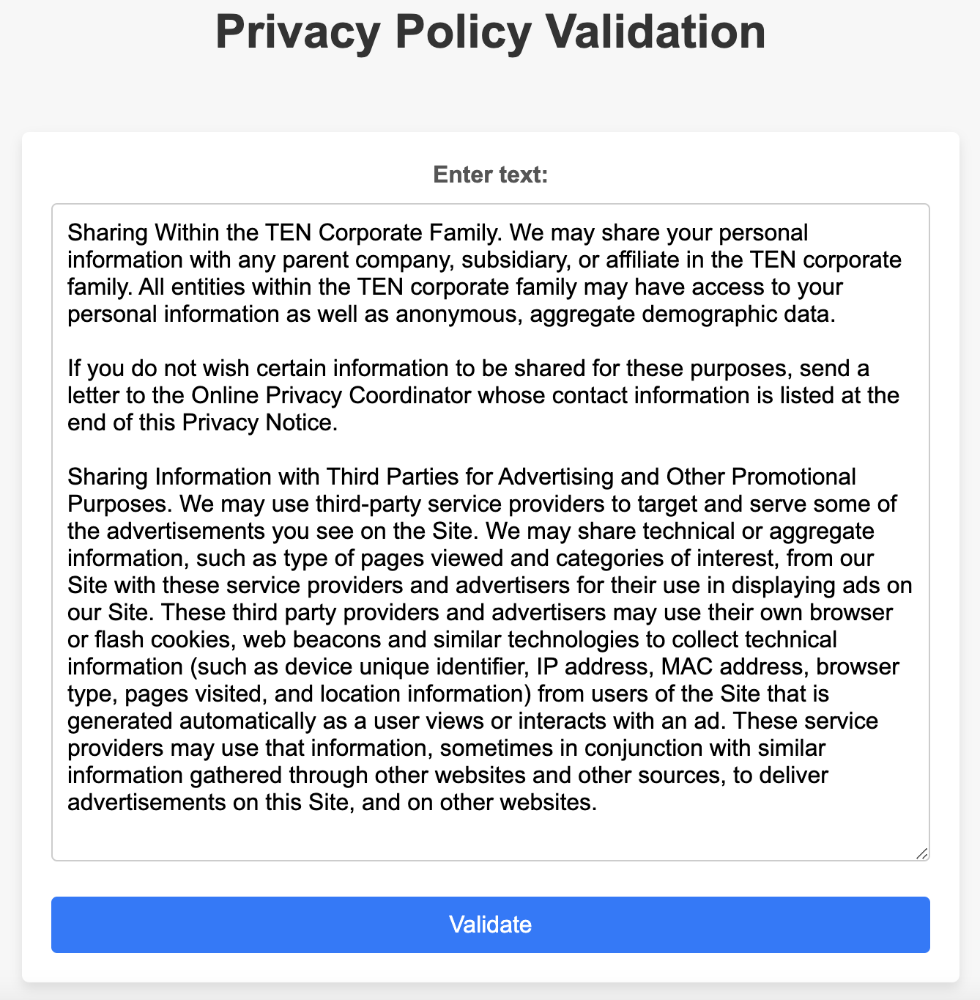

<!-- Improved compatibility of back to top link: See: https://github.com/othneildrew/Best-README-Template/pull/73 -->
<a name="readme-top"></a>
<!--
*** Thanks for checking out the Best-README-Template. If you have a suggestion
*** that would make this better, please fork the repo and create a pull request
*** or simply open an issue with the tag "enhancement".
*** Don't forget to give the project a star!
*** Thanks again! Now go create something AMAZING! :D
-->


<!-- PROJECT SHIELDS -->
<!--
*** I'm using markdown "reference style" links for readability.
*** Reference links are enclosed in brackets [ ] instead of parentheses ( ).
*** See the bottom of this document for the declaration of the reference variables
*** for contributors-url, forks-url, etc. This is an optional, concise syntax you may use.
*** https://www.markdownguide.org/basic-syntax/#reference-style-links
-->
[![Contributors][contributors-shield]][contributors-url]
[![Forks][forks-shield]][forks-url]
[![Stargazers][stars-shield]][stars-url]
[![Issues][issues-shield]][issues-url]
[![MIT License][license-shield]][license-url]
[![LinkedIn][linkedin-shield]][linkedin-url]


<!-- PROJECT LOGO -->
<br />
<div align="center">
  <a href="https://github.com/Ethan4thewin/NLP-policy">
    
  </a>

<h3 align="center">AI System for Classifying, Evaluating and Interpreting Privacy Policies and Terms of Conditions</h3>

  <p align="center">
    NLP system with web application
    <br />
    <br />
    <a href="https://github.com/Ethan4thewin/NLP-policy">View Demo</a>
    ·
    <a href="https://github.com/Ethan4thewin/NLP-policy/issues">Report Bug or Request Feature</a>
  </p>
</div>


<!-- TABLE OF CONTENTS -->
<details>
  <summary>Table of Contents</summary>
  <ol>
    <li>
      <a href="#about-the-project">About The Project</a>
      <ul>
        <li><a href="#built-with">Built With</a></li>
      </ul>
    </li>
    <li><a href="#setup">Setup</a></li>
    <li><a href="#usage">Usage</a></li>
    <li><a href="#contributing">Contributing</a></li>
    <li><a href="#license">License</a></li>
    <li><a href="#contact">Contact</a></li>
    <li><a href="#acknowledgments">Acknowledgments</a></li>
  </ol>
</details>


<!-- ABOUT THE PROJECT -->
## About The Project

<div align="center">
  
</div>

A versatile web application that leverages natural language processing (NLP) and machine learning techniques to assist users in evaluating policy documents for its acceptability and identifying potential issues. The tool provides users with an efficient and effective means of ensuring that their policies adhere to predefined standards, all while highlighting and summarising the problematic parts of the policies.
The current workflow is:
* Data Preparation: Text data was preprocessed to normalize case, remove stopwords, tokenize, and lemmatize it.
* Data Extraction: Word2Vec, trained on Google News data, transformed text into numerical vectors, capturing semantic word relationships.
* Machine Learning Models: Various models, including Decision Tree, Random Forest, Support Vector Machine (SVM), Logistic Regression, and Convolutional Neural Network (CNN), were used for text classification. Hyperparameter tuning enhanced model performance.
* Problematic Phrases: Highlighted problematic phrases in text using HTML <span> with red background.
* Summarization: Automated text summarization with the BART model from HuggingFace to generate concise summaries.


<p align="right">(<a href="#readme-top">back to top</a>)</p>


### Built With


<p align="right">(<a href="#readme-top">back to top</a>)</p>


<!-- GETTING STARTED -->
## Setup

### Fast deployment
The model used in this instance is SVM, with tested result up to 95% accuracy.
1. Clone or [download](https://github.com/Ethan4thewin/NLP-policy/archive/refs/heads/patch-1.zip) the repo.
2. [Download](https://drive.google.com/file/d/1M4A7LNoHbNQ_glJ3Jz4fUNwAatRGfDbo/view?usp=sharing) the pre-trained word embeddings from Google News Word2Vec, unzip and put the .bin file in the main folder.
3. Install required packages
   All packages use:
    1. **pandas**: For data manipulation and analysis.
    2. **numpy**: For numerical operations and arrays.
    3. **gensim**: For Word2Vec model usage.
    4. **scikit-learn**: For machine learning tasks, including classifiers, evaluation metrics, and preprocessing tools.
    5. **nltk**: For natural language processing tasks, such as text tokenization and stopword removal.
    6. **string**: Python standard library for string operations.
    7. **keras**: For deep learning models, including the Convolutional Neural Network (CNN) in your code.
    8. **matplotlib**: For data visualization (if needed).
    9. **flask**: For developing web applications (if used).
    10. **transformers**: For working with pre-trained models from HuggingFace (used for summarization).
    11. **tensorflow**: Required for Keras and deep learning models.
  ```sh
  pip install pandas numpy gensim scikit-learn nltk string keras matplotlib flask transformers tensorflow
  ```

3. Run app.py. It will start a web server that listens on a specified port (usually port 5000 by default).
4. Connect to localhost:*insert specified port* (by default, it will be localhost:5000)

### Configurations
The app.py classification model is currently SVM model in the .pkl file from the current five models pool: Decision Tree, Random Forest, SVM, Logistic Regression, and CNN. The classification model can be changed by running the [Jupyter Notebook](final_code.ipynb) and change the function _classify_policy(policy_text)_ by uncomment the desired model. Then, you can rerun the notebook and the app.py to reflect the changes.

<p align="right">(<a href="#readme-top">back to top</a>)</p>


<!-- USAGE EXAMPLES -->
## Usage
The project's primary usage is for text classification and summarization. It can be applied to automatically categorize and generate concise summaries of text data, making it useful for tasks such as content moderation, information retrieval, and document summarization. The web application (if deployed) provides a user-friendly interface for accessing these functionalities.
### Example
<div align="center">
  
</div>

<div align="center">
  
</div>

<p align="right">(<a href="#readme-top">back to top</a>)</p>

<!-- CONTRIBUTING -->
## Contributing

Contributions are what make the open source community such an amazing place to learn, inspire, and create. Any contributions you make are **greatly appreciated**.

If you have a suggestion that would make this better, please fork the repo and create a pull request. You can also simply open an issue with the tag "enhancement".
Don't forget to give the project a star! Thanks again!

1. Fork the Project
2. Create your Feature Branch (`git checkout -b feature/AmazingFeature`)
3. Commit your Changes (`git commit -m 'Add some AmazingFeature'`)
4. Push to the Branch (`git push origin feature/AmazingFeature`)
5. Open a Pull Request

<p align="right">(<a href="#readme-top">back to top</a>)</p>


<!-- LICENSE -->
## License

Distributed under the MIT License. See [LICENSE](LICENSE) for more information.

<p align="right">(<a href="#readme-top">back to top</a>)</p>


<!-- CONTACT -->
## Contact

Ethan - phatnguyenground@gmail.com - [My LinkedIn][linkedin-url] - [My Website](https://ethanbyday.notion.site/)

Project Link: [https://github.com/Ethan4thewin/NLP-policy](https://github.com/Ethan4thewin/NLP-policy)

<p align="right">(<a href="#readme-top">back to top</a>)</p>


<!-- ACKNOWLEDGMENTS -->
## Acknowledgments

I would like to express my gratitude to [Dr. Humphrey O. Obie](https://scholar.google.com/citations?user=rxRSkJwAAAAJ) for his invaluable guidance and mentorship throughout the project. I also would like to thank my team members for their support, contributions to this project, and for being good friends.

<p align="right">(<a href="#readme-top">back to top</a>)</p>


<!-- MARKDOWN LINKS & IMAGES -->
<!-- https://www.markdownguide.org/basic-syntax/#reference-style-links -->
[contributors-shield]: https://img.shields.io/github/contributors/Ethan4thewin/NLP-policy.svg?style=for-the-badge
[contributors-url]: https://github.com/Ethan4thewin/NLP-policy/graphs/contributors
[forks-shield]: https://img.shields.io/github/forks/Ethan4thewin/NLP-policy.svg?style=for-the-badge
[forks-url]: https://github.com/Ethan4thewin/NLP-policy/network/members
[stars-shield]: https://img.shields.io/github/stars/Ethan4thewin/NLP-policy.svg?style=for-the-badge
[stars-url]: https://github.com/Ethan4thewin/NLP-policy/stargazers
[issues-shield]: https://img.shields.io/github/issues/Ethan4thewin/NLP-policy.svg?style=for-the-badge
[issues-url]: https://github.com/Ethan4thewin/NLP-policy/issues
[license-shield]: https://img.shields.io/github/license/Ethan4thewin/NLP-policy.svg?style=for-the-badge
[license-url]: https://github.com/Ethan4thewin/NLP-policy/blob/master/LICENSE.txt
[linkedin-shield]: https://img.shields.io/badge/-LinkedIn-black.svg?style=for-the-badge&logo=linkedin&colorB=555
[linkedin-url]: https://www.linkedin.com/in/ethan-by-day/
